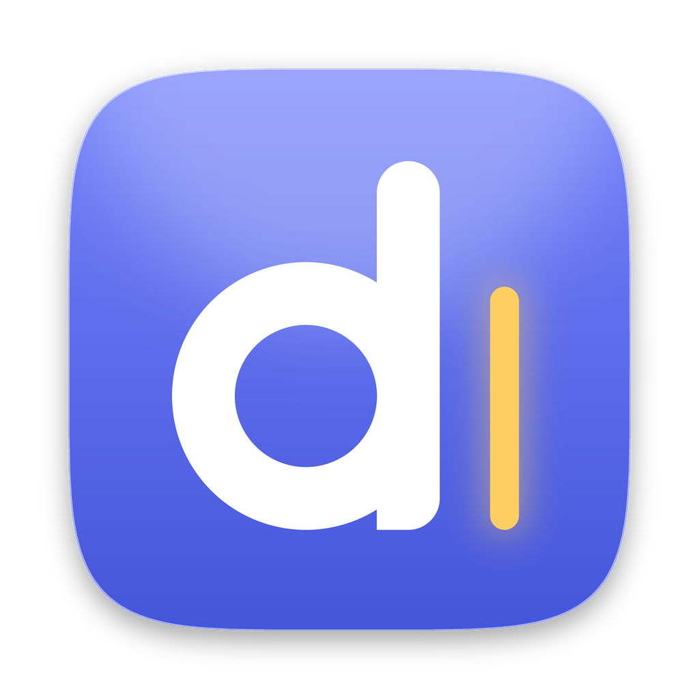
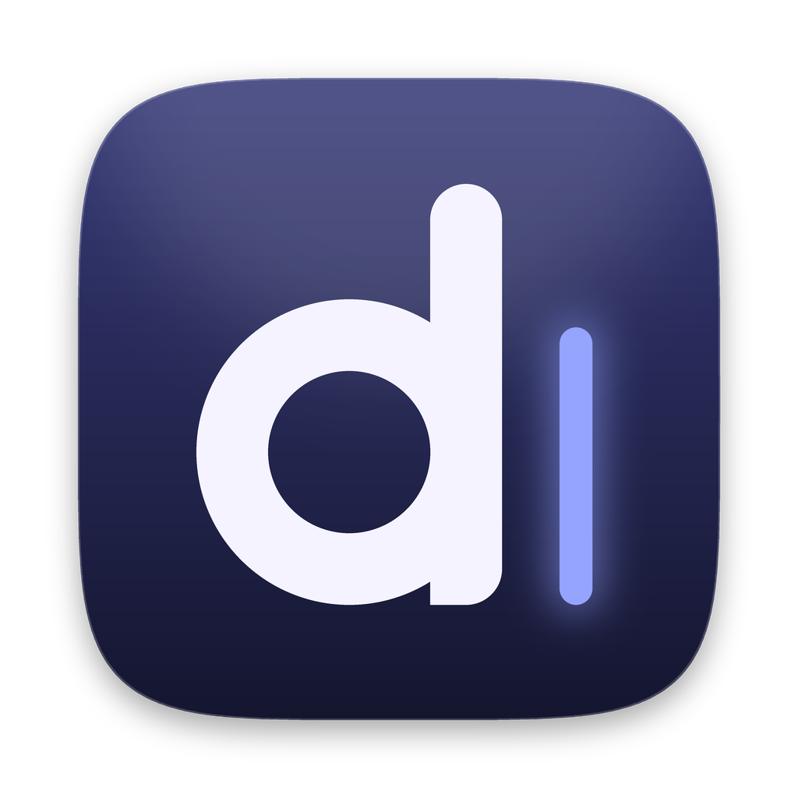
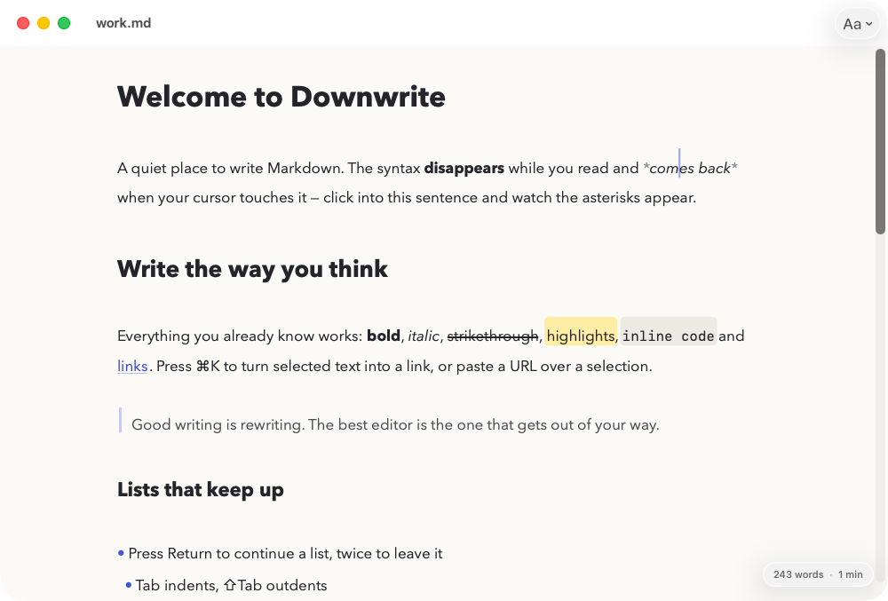
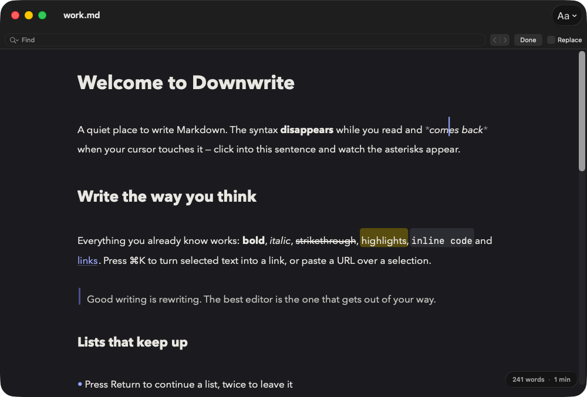
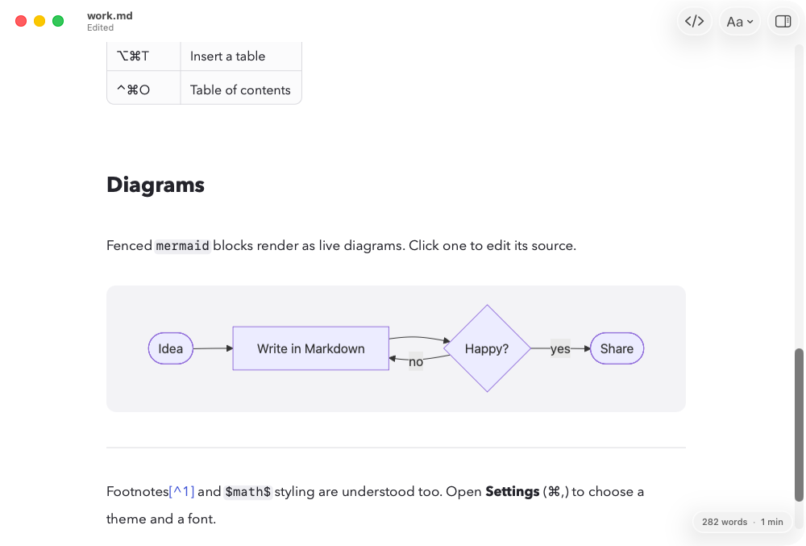
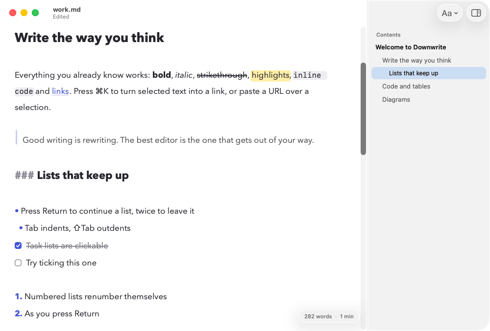
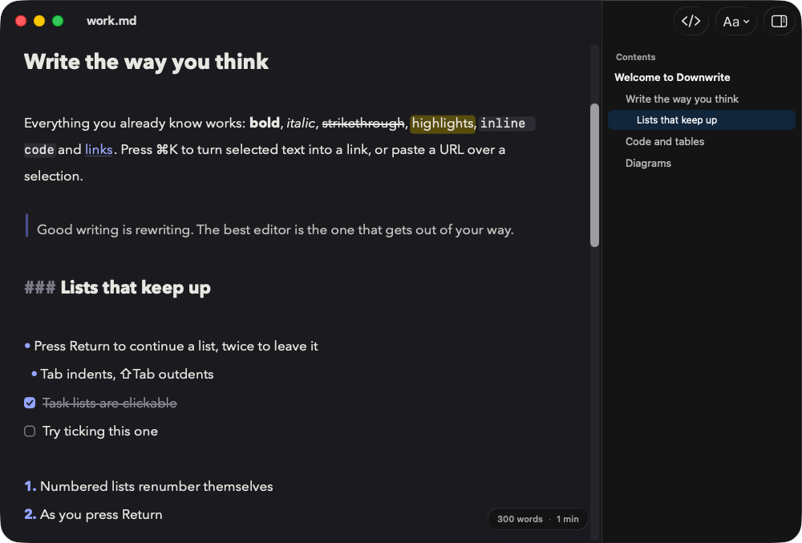

<p align="center">
  
  
</p>

# Downwrite

A quiet, native Markdown editor for the Mac — light-weight, beautiful to type in, and happy to be your default `.md` app.

Markdown syntax **disappears while you read** and **comes back when your cursor touches it**. Click into a bold word and the asterisks fade in; move away and they vanish. Everything is built with SwiftUI + AppKit, with no Electron, no web editor and no account.

<p align="center">
  
  
</p>
<p align="center">
  
</p>
<p align="center">
  
  
</p>

<sub>Screenshots are captured automatically from the real app on a macOS 26 runner by the end-to-end self-test (see Testing).</sub>

## Features

- **Hidden syntax, Bear-style.** `**bold**`, `*italic*`, `` `code` ``, `[links](…)`, `# headings`, `> quotes`, code fences… all collapse to clean typography and re-expand around the caret.
- **CommonMark + GFM + extras.** Full CommonMark (via Apple's `swift-markdown` / cmark-gfm), plus tables, task lists (drawn as rounded checkboxes — click to tick; the `- [ ]` source shows when the caret enters it), strikethrough, autolinks, `==highlight==`, `[^footnotes]`, `$math$` styling and YAML front matter.
- **Editable tables.** Tables are shown as a real grid you type into, not as pipes and dashes. **Tab** jumps to the next cell (and adds a row from the last cell), **Return** moves down, arrows step across cell edges, ⇧Return adds a line break. Drag the grips left of each row / above each column to reorder them, click a grip (or right-click any cell) for insert / delete / move / duplicate / align / sort, and use the **+** strips to append a row or column. Cell text keeps its Markdown (bold, links, code hide their syntax like everywhere else), pasting spreadsheet data fills several cells, and *Edit as Markdown* shows the source. The document text stays plain GFM, aligned and tidy.
- **Mermaid diagrams.** Fenced ```` ```mermaid ```` blocks render as live diagrams (flowcharts, sequence, class, state, ER, Gantt, pie, journey, git graph, mind maps…). Mermaid is bundled, so it works offline. Click a diagram to edit its source; it re-renders as you type.
- **Table of contents.** Toggle a sidebar on the right (⌃⌘O, the toolbar button, or View ▸ Show Table of Contents) that lists the document's headings, nested by level, with the section holding the caret highlighted. Click a heading and the editor scrolls it to the top and puts the caret there, ready to type. Headings show as they read in the editor (no `#`, `**` or link syntax), update as you type, and the sidebar remembers whether you left it open.
- **Beautiful type.** Avenir Next (default), New York, SF Pro, Charter or SF Mono, with adjustable size, line spacing and column width. A centred readable column, rounded code cards, quote bars and soft rules.
- **Light, dark or follow macOS.** Settings → Theme (or View ▸ Appearance). The app icon is an Icon Composer asset (light, dark and tinted variants chosen by macOS) and the Dock icon also swaps between the light and dark artwork while the app runs.
- **Liquid Glass.** Built for macOS 26 "Tahoe" and ready for macOS 27 "Golden Gate": system toolbar and window chrome adopt Liquid Glass automatically, and the floating word-count pill uses `glassEffect`.
- **A proper Mac document app.** Tabs, Versions, autosave, Open Recent, drag-and-drop onto the Dock icon, Find (⌘F), full undo/redo. Opens and saves UTF-8 (± BOM), UTF-16 and legacy Windows-1252 files and **preserves line endings** (LF / CRLF) so it never rewrites a file's format behind your back.
- **Smart keys.** Return continues lists, tasks, numbered lists and quotes (press it twice to leave); Tab / ⇧Tab indent and outdent; paste a URL over selected text to make a link.
- **Small.** Under 10 MB on disk, most of it the bundled Mermaid engine. No network access needed except for remote images.
- **Inline images.** `` on its own line shows the picture below the (collapsed) Markdown.

## Keyboard shortcuts

| Action | Shortcut | Action | Shortcut |
| --- | --- | --- | --- |
| **Bold** | ⌘B | Bulleted list | ⇧⌘8 |
| *Italic* | ⌘I | Numbered list | ⇧⌘7 |
| ~~Strikethrough~~ | ⇧⌘X | Task list | ⇧⌘9 |
| ==Highlight== | ⇧⌘H | Block quote | ⇧⌘. |
| `Inline code` | ⌘E | Code block | ⌥⌘C |
| Link | ⌘K | Horizontal rule | ⌥⌘- |
| Heading 1–6 | ⌘1 … ⌘6 | Insert / format table | ⌥⌘T / ⇧⌥⌘T |
| Body text | ⌘0 | Indent / outdent | ⌘] / ⌘[ (or Tab / ⇧Tab in lists) |
| Find | ⌘F | Bigger / smaller text | ⌘= / ⌘- |
| Table of contents | ⌃⌘O | | |
| Next / previous table cell | Tab / ⇧Tab | New table row (in the last cell) | Tab or Return |

Pressing a formatting shortcut again removes the formatting. With nothing selected it wraps the word under the caret (or inserts an empty pair). Standard shortcuts (⌘Z, ⇧⌘Z, ⌘C/V/X, ⌘A, ⌘S, ⌘W, ⌘T …) work as in any Mac app. ⌘-click a link to open it.

## Requirements

- **To run:** macOS 26 (Tahoe) or later — including macOS 27 (Golden Gate).
- **To build:** Xcode 26 or later (Swift 6.2+), installed as the toolchain — you never need to open it, everything builds from the Terminal. Command Line Tools alone are untested: `actool`, which compiles the adaptive light/dark app icon, ships only with full Xcode (without it `build-app.sh` falls back to a static icon).

## Build and run

```bash
git clone https://github.com/derrickwheals/downwrite.git
cd downwrite

swift run Downwrite          # quick debug run (no bundle, no file associations)
swift test                   # unit + integration tests (needs a GUI session on macOS)
scripts/build-app.sh         # → dist/Downwrite.app  (release build, ad-hoc signed)
open dist/Downwrite.app
```

`scripts/build-app.sh` accepts `VERSION`, `BUILD`, `CONFIG` and `SIGN_IDENTITY` environment variables:

```bash
VERSION=1.2.0 BUILD=42 scripts/build-app.sh
```

### Install locally

```bash
cp -R dist/Downwrite.app /Applications/
```

An ad-hoc signed build runs fine on the Mac that built it. If you copy it to another Mac, macOS will quarantine it: right-click ▸ **Open** once, or run `xattr -dr com.apple.quarantine /Applications/Downwrite.app`.

### Make Downwrite your default Markdown editor

Any one of:

1. **Downwrite ▸ Make Downwrite the Default Markdown App** (or Settings ▸ Files) — macOS asks you to confirm.
2. In Finder, select any `.md` file ▸ **Get Info** (⌘I) ▸ **Open with** ▸ Downwrite ▸ **Change All…**
3. From the Terminal: Downwrite declares itself the *Owner* of `net.daringfireball.markdown` (`.md`, `.markdown`, `.mdown`, `.mkd`, `.mkdn`, `.mdwn`, `.mdtxt`, `.mdtext`) and an *Alternate* for plain text.

## Deployment (distributable build)

To share Downwrite outside your own Mac you need an Apple Developer ID certificate.

```bash
# 1. Build, sign with hardened runtime + secure timestamp
SIGN_IDENTITY="Developer ID Application: Your Name (TEAMID)" VERSION=1.0.0 BUILD=1 scripts/build-app.sh

# 2. Package
VERSION=1.0.0 scripts/make-dmg.sh            # → dist/Downwrite-1.0.0.dmg

# 3. Notarize and staple (one-time: xcrun notarytool store-credentials "downwrite-notary" …)
xcrun notarytool submit dist/Downwrite-1.0.0.dmg --keychain-profile "downwrite-notary" --wait
xcrun stapler staple dist/Downwrite-1.0.0.dmg

# 4. Verify
spctl --assess --type open --context context:primary-signature -v dist/Downwrite-1.0.0.dmg
```

The app is **not sandboxed** (it reads sibling files for relative links and opens documents anywhere you point it).

> **Mac App Store note.** The GPL-3.0 and the App Store's terms are widely considered incompatible for *third parties* redistributing the code there. Direct download, GitHub Releases and Homebrew-style distribution are fine. As the sole copyright holder you may publish your own build elsewhere under different terms, but once you accept outside contributions you would need contributors' agreement (e.g. a CLA) to do so. If you ever go that route you would also add the App Sandbox entitlements to `Packaging/Downwrite.entitlements`.

### Releases from GitHub

Pushing a tag like `v1.0.0` runs `.github/workflows/release.yml`, which builds on a `macos-26` runner, packages `Downwrite-<version>.dmg` and attaches it to a GitHub Release. If the repository has the secrets `DEVELOPER_ID_P12_BASE64`, `DEVELOPER_ID_P12_PASSWORD`, `DEVELOPER_ID_NAME`, `NOTARY_APPLE_ID`, `NOTARY_TEAM_ID` and `NOTARY_PASSWORD` (an app-specific password), the release is Developer-ID signed and notarized; otherwise it is ad-hoc signed.

## Testing

Three layers, all run by CI on every push (see `.github/workflows/ci.yml`):

| Layer | Where | What it covers |
| --- | --- | --- |
| **Core unit tests** (`Tests/DownwriteCoreTests`) | Linux *and* macOS | The Markdown analysis engine (CommonMark/GFM structure, hidden-marker rules, Unicode/CRLF offsets, adversarial input), every formatting shortcut, list/quote continuation, the table model (parsing with cell ranges, every row/column command, Tab/Return navigation, sort, paste, column layout, leaving and deleting a table), file encodings and line endings, palette contrast (WCAG) and the white light-theme background, the table-of-contents outline (nesting, visible titles, caret → section), Mermaid helpers. |
| **App integration tests** (`Tests/DownwriteTests`) | macOS | Real `NSTextView` editor in a real window: attributes for every Markdown construct, markers hiding/revealing as the caret moves, typing, undo/redo, smart Return/Tab, paste-to-link, theme switching, Mermaid rendering of ten diagram types plus error handling, the table of contents sidebar's model, caret tracking and click-to-scroll, the table grid (layout over the collapsed source, typing with one-step undo, Tab/Return/arrow navigation, the right-click menu, grip dragging, focus hand-off, Markdown-source view), Info.plist file-association checks, and PNG snapshots for visual review. |
| **End-to-end self-test** (`Downwrite --selftest`) | macOS | Launches the *packaged app*, opens a file through the document system, presses real ⌘B/⌘I/⌘E/⌘2/⌘K key events through the real menu bar, types, saves to disk and re-reads the file, waits for a Mermaid card, tabs through the table grid with real key events (adding a row, typing, the right-click menu, undo), toggles the table-of-contents sidebar with ⌃⌘O and clicks a heading to scroll to it, flips light → dark → system theme, and screenshots the actual window. |

Run the core tests on any machine with Docker (no Mac needed):

```bash
scripts/linux-test.sh
```

Run the end-to-end test yourself:

```bash
scripts/build-app.sh
dist/Downwrite.app/Contents/MacOS/Downwrite --selftest-out=/tmp/downwrite-e2e --selftest-input="$PWD/Sources/Downwrite/Resources/Welcome.md"
cat /tmp/downwrite-e2e/selftest-report.txt
```

## Project layout

```
Sources/DownwriteCore/   Pure Swift (Foundation + swift-markdown): analysis, commands, palettes, file coding
Sources/Downwrite/       macOS app: SwiftUI shell, TextKit 1 editor, styler, Mermaid renderer, settings
Tests/DownwriteCoreTests Linux + macOS unit tests
Tests/DownwriteTests     macOS integration tests
Packaging/               Info.plist, entitlements, icon artwork
scripts/                 build-app.sh, make-dmg.sh, linux-test.sh, ci-local.sh, generate-icons.py
ThirdParty/              Third-party licence texts (swift-markdown, cmark-gfm, Mermaid)
LICENSE                  GNU GPL v3.0
```

How it works, in one paragraph: `MarkdownAnalyzer` parses the text with cmark-gfm and produces an immutable `MarkdownAnalysis` — style spans, *marker* ranges (the syntax characters) with the range that reveals each one, and per-line block styles. `MarkdownStyler` turns that into `NSTextStorage` attributes; hidden markers get a 0.1 pt clear font so they stay in the text (copy, undo and find keep working) but take no space. When the caret moves, only the lines whose markers changed state are restyled. The table-of-contents sidebar is a SwiftUI `.inspector` fed by `TableOfContents` (rows built from the analysed headings, with `MarkdownAnalysis.headingIndex(at:)` mapping the caret to its section); a click moves the caret to the heading and `EditorTextView.scrollToTop(of:)` scrolls it into place. Top-level tables are parsed into a `TableModel` (cell source text, alignments, where each cell sits in the document) and shown by `TableGridView`, a grid of small TextKit 1 editors laid over the table's collapsed source; every edit goes back through `TableModel.markdown` so the document text is the single source of truth and undo just works. Mermaid blocks are rendered once in a hidden `WKWebView` to SVG and shown in a click-through card placed in vertical space reserved under the collapsed source.

## Known limitations

- Images are previewed inline when they sit on a line of their own (local paths are resolved relative to the document; `http(s)` images load from the network). Images inside a paragraph are styled but not previewed.
- Math (`$…$`, `$$…$$`) is styled, not typeset.
- Tables inside block quotes or list items stay as Markdown source (only top-level tables become a grid). Column widths are automatic — Markdown has nowhere to store them — and cells cannot hold real line breaks (use `<br>`, which ⇧Return inserts).
- Liquid Glass chrome comes from the system on macOS 26+; Downwrite deliberately keeps the writing surface opaque for legibility. Icon Composer light/dark/tinted variants are compiled with `actool` when it succeeds in `scripts/build-app.sh`; otherwise the app falls back to the bundled `.icns` (the Dock icon still switches light/dark at runtime).
- Built and tested against the macOS 26 SDK (Xcode 26.x). macOS 27 specific APIs are not required.

## License

Downwrite is free software: you can redistribute it and/or modify it under the terms of the **GNU General Public License v3.0** — see [`LICENSE`](LICENSE). Copyright © 2026 Derrick Wheals.

Third-party components (swift-markdown, cmark-gfm, Mermaid) and their licences are listed in [`THIRD-PARTY-NOTICES.md`](THIRD-PARTY-NOTICES.md); the licence texts ship inside the app at `Contents/Resources/Legal/`. Contributions are accepted under the same licence.

## Credits

Markdown parsing by [swift-markdown](https://github.com/swiftlang/swift-markdown) (cmark-gfm). Diagrams by [Mermaid](https://mermaid.js.org) (MIT, see `ThirdParty/mermaid-LICENSE.txt`).
