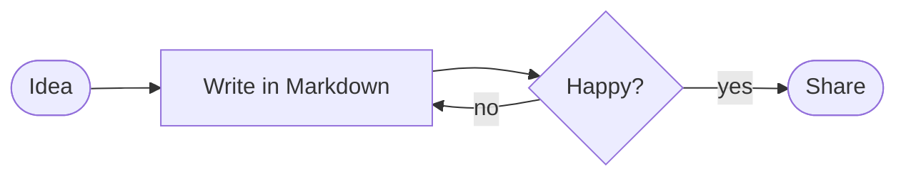

# Welcome to Downwrite

A quiet place to write Markdown. The syntax **disappears** while you read and *comes back* when your cursor touches it — click into this sentence and watch the asterisks appear.

## Write the way you think

Everything you already know works: **bold**, *italic*, ~~strikethrough~~, ==highlights==, `inline code` and [links](https://commonmark.org/help/). Press ⌘K to turn selected text into a link, or paste a URL over a selection.

> Good writing is rewriting. The best editor is the one that gets out of your way.

### Lists that keep up

- Press Return to continue a list, twice to leave it
  - Tab indents, ⇧Tab outdents
- [x] Task lists are clickable
- [ ] Try ticking this one

1. Numbered lists renumber themselves
2. As you press Return

## Code and tables

```swift
func greet(_ name: String) -> String {
    "Hello, \(name)!"
}
```

| Shortcut | Action          |
| -------- | --------------- |
| ⌘B       | **Bold**        |
| ⌘I       | *Italic*        |
| ⌘K       | Link            |
| ⌥⌘T      | Insert a table  |

## Diagrams

Fenced `mermaid` blocks render as live diagrams. Click one to edit its source.



---

Footnotes[^1] and `$math$` styling are understood too. Open **Settings** (⌘,) to choose a theme and a font.

[^1]: Like this one.
