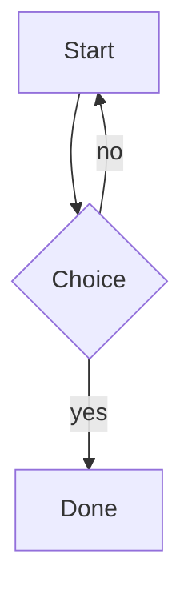

# Fixture P with **bold** and [a link](https://example.com)

This is the one document the export tests and the walk-through use. It holds every construct the output has to get right.

Setext heading
==============

Text before the repeated headings so a heading can land near the end of a page.

## Same name

First section with the repeated heading.

## Same name

Second section with the repeated heading, whose id gets a suffix.

## Reading **this**

A link back to this section: [jump](#reading-this). And one that goes up: [to the top](#Fixture-P-with-bold-and-a-linkhttpsexamplecom).

## Text

*emphasis*, **strong**, ***both***, ~~strike~~, ==highlight==, `inline code`, <u>under</u>, H<sub>2</sub>O, and x<sup>2</sup>.

A bare URL: https://example.com and www.example.com/page and [an explicit link](https://example.com/explicit).

"straight quotes" -- ... 'single' stays as typed.

A hard break ends this line  
and this one follows. A highlight that spans ==markup **inside** it== too.

## Lists

- bullet one
  1. numbered inside
     - bullet inside that
     - another
  2. second numbered
- bullet two

3. starts at three
4. and goes on

- [ ] an open task
- [x] a ticked task
  - [ ] a nested open task
1. [x] a numbered ticked task
2. [ ] a numbered open task

Loose list:

- first

- second

## Quote

> A quote with **formatting**.
>
> > A nested quote with a list:
> >
> > - one
> > - two
> >
> > ```
> > code in a quote
> > ```

## Table

| Row | Code | Value |
|:----|:----:|------:|
| Row 001 | `code 1` | 7<br>end of row 001 |
| Row 002 | `code 2` | 14<br>end of row 002 |
| Row 003 | `code 3` | 21<br>end of row 003 |
| Row 004 | `code 4` | 28<br>end of row 004 |
| Row 005 | `code 5` | 35<br>end of row 005 |
| Row 006 | `code 6` | 42<br>end of row 006 |
| Row 007 | `code 7` | 49<br>end of row 007 |
| Row 008 | `code 8` | 56<br>end of row 008 |
| Row 009 | `code 9` | 63<br>end of row 009 |
| Row 010 | `code 10` | 70<br>end of row 010 |
| Row 011 | `code 11` | 77<br>end of row 011 |
| Row 012 | `code 12` | 84<br>end of row 012 |
| Row 013 | `code 13` | 91<br>end of row 013 |
| Row 014 | `code 14` | 98<br>end of row 014 |
| Row 015 | `code 15` | 4<br>end of row 015 |
| Row 016 | `code 16` | 11<br>end of row 016 |
| Row 017 | `code 17` | 18<br>end of row 017 |
| Row 018 | `code 18` | 25<br>end of row 018 |
| Row 019 | `code 19` | 32<br>end of row 019 |
| Row 020 | `code 20` | 39<br>end of row 020 |
| Row 021 | `code 21` | 46<br>end of row 021 |
| Row 022 | `code 22` | 53<br>end of row 022 |
| Row 023 | `code 23` | 60<br>end of row 023 |
| Row 024 | `code 24` | 67<br>end of row 024 |
| Row 025 | `code 25` | 74<br>end of row 025 |
| Row 026 | `code 26` | 81<br>end of row 026 |
| Row 027 | `code 27` | 88<br>end of row 027 |
| Row 028 | `code 28` | 95<br>end of row 028 |
| Row 029 | `code 29` | 1<br>end of row 029 |
| Row 030 | `code 30` | 8<br>end of row 030 |
| Row 031 | `code 31` | 15<br>end of row 031 |
| Row 032 | `code 32` | 22<br>end of row 032 |
| Row 033 | `code 33` | 29<br>end of row 033 |
| Row 034 | `code 34` | 36<br>end of row 034 |
| Row 035 | `code 35` | 43<br>end of row 035 |
| Row 036 | `code 36` | 50<br>end of row 036 |
| Row 037 | `code 37` | 57<br>end of row 037 |
| Row 038 | `code 38` | 64<br>end of row 038 |
| Row 039 | `code 39` | 71<br>end of row 039 |
| Row 040 | `code 40` | 78<br>end of row 040 |
| Row 041 | `code 41` | 85<br>end of row 041 |
| Row 042 | `code 42` | 92<br>end of row 042 |
| Row 043 | `code 43` | 99<br>end of row 043 |
| Row 044 | `code 44` | 5<br>end of row 044 |
| Row 045 | `code 45` | 12<br>end of row 045 |
| Row 046 | `code 46` | 19<br>end of row 046 |
| Row 047 | `code 47` | 26<br>end of row 047 |
| Row 048 | `code 48` | 33<br>end of row 048 |
| Row 049 | `code 49` | 40<br>end of row 049 |
| Row 050 | `code 50` | 47<br>end of row 050 |
| Row 051 | `code 51` | 54<br>end of row 051 |
| Row 052 | `code 52` | 61<br>end of row 052 |
| Row 053 | `code 53` | 68<br>end of row 053 |
| Row 054 | `code 54` | 75<br>end of row 054 |
| Row 055 | `code 55` | 82<br>end of row 055 |
| Row 056 | `code 56` | 89<br>end of row 056 |
| Row 057 | `code 57` | 96<br>end of row 057 |
| Row 058 | `code 58` | 2<br>end of row 058 |
| Row 059 | `code 59` | 9<br>end of row 059 |
| Row 060 | `code 60` | 16<br>end of row 060 |
| Row 061 | `code 61` | 23<br>end of row 061 |
| Row 062 | `code 62` | 30<br>end of row 062 |
| Row 063 | `code 63` | 37<br>end of row 063 |
| Row 064 | `code 64` | 44<br>end of row 064 |
| Row 065 | `code 65` | 51<br>end of row 065 |
| Row 066 | `code 66` | 58<br>end of row 066 |
| Row 067 | `code 67` | 65<br>end of row 067 |
| Row 068 | `code 68` | 72<br>end of row 068 |
| Row 069 | `code 69` | 79<br>end of row 069 |
| Row 070 | `code 70` | 86<br>end of row 070 |
| Row 071 | `code 71` | 93<br>end of row 071 |
| Row 072 | `code 72` | 100<br>end of row 072 |
| Row 073 | `code 73` | 6<br>end of row 073 |
| Row 074 | `code 74` | 13<br>end of row 074 |
| Row 075 | `code 75` | 20<br>end of row 075 |
| Row 076 | `code 76` | 27<br>end of row 076 |
| Row 077 | `code 77` | 34<br>end of row 077 |
| Row 078 | `code 78` | 41<br>end of row 078 |
| Row 079 | `code 79` | 48<br>end of row 079 |
| Row 080 | `code 80` | 55<br>end of row 080 |
| Row 081 | `code 81` | 62<br>end of row 081 |
| Row 082 | `code 82` | 69<br>end of row 082 |
| Row 083 | `code 83` | 76<br>end of row 083 |
| Row 084 | `code 84` | 83<br>end of row 084 |
| Row 085 | `code 85` | 90<br>end of row 085 |
| Row 086 | `code 86` | 97<br>end of row 086 |
| Row 087 | `code 87` | 3<br>end of row 087 |
| Row 088 | `code 88` | 10<br>end of row 088 |
| Row 089 | `code 89` | 17<br>end of row 089 |
| Row 090 | `code 90` | 24<br>end of row 090 |
| Row 091 | `code 91` | 31<br>end of row 091 |
| Row 092 | `code 92` | 38<br>end of row 092 |
| Row 093 | `code 93` | 45<br>end of row 093 |
| Row 094 | `code 94` | 52<br>end of row 094 |
| Row 095 | `code 95` | 59<br>end of row 095 |
| Row 096 | `code 96` | 66<br>end of row 096 |
| Row 097 | `code 97` | 73<br>end of row 097 |
| Row 098 | `code 98` | 80<br>end of row 098 |
| Row 099 | `code 99` | 87<br>end of row 099 |
| Row 100 | `code 100` | 94<br>end of row 100 |
| Row 101 | `code 101` | 0<br>end of row 101 |
| Row 102 | `code 102` | 7<br>end of row 102 |
| Row 103 | `code 103` | 14<br>end of row 103 |
| Row 104 | `code 104` | 21<br>end of row 104 |
| Row 105 | `code 105` | 28<br>end of row 105 |
| Row 106 | `code 106` | 35<br>end of row 106 |
| Row 107 | `code 107` | 42<br>end of row 107 |
| Row 108 | `code 108` | 49<br>end of row 108 |
| Row 109 | `code 109` | 56<br>end of row 109 |
| Row 110 | `code 110` | 63<br>end of row 110 |
| Row 111 | `code 111` | 70<br>end of row 111 |
| Row 112 | `code 112` | 77<br>end of row 112 |
| Row 113 | `code 113` | 84<br>end of row 113 |
| Row 114 | `code 114` | 91<br>end of row 114 |
| Row 115 | `code 115` | 98<br>end of row 115 |
| Row 116 | `code 116` | 4<br>end of row 116 |
| Row 117 | `code 117` | 11<br>end of row 117 |
| Row 118 | `code 118` | 18<br>end of row 118 |
| Row 119 | `code 119` | 25<br>end of row 119 |
| Row 120 | `code 120` | 32<br>end of row 120 |

## Code

```
</pre><script>alert(1)</script> & <b>
  indented line

after a blank line
```

    an indented code block
      keeps its indentation

```
xxxxxxxxxxxxxxxxxxxxxxxxxxxxxxxxxxxxxxxxxxxxxxxxxxxxxxxxxxxxxxxxxxxxxxxxxxxxxxxxxxxxxxxxxxxxxxxxxxxxxxxxxxxxxxxxxxxxxxxxxxxxxxxxxxxxxxxxxxxxxxxxxxxxxxxxxxxxxxxxxxxxxxxxxxxxxxxxxxxxxxxxxxxxxxxxxxxxxxxxxxxxxxxxxxxxxxxxxxxxxxxxxxxxxxxxxxxxxxxxxxxxxxxxxxxxxxxxxxxxxxxxxxxxxxxxxxxxxxxxxxxxxxxxxxxxxxxxxxxx
```

## Diagrams



The same diagram again:


And one with a syntax error:

```mermaid
graph TD
  A --> ((
```

## Images

A local PNG:  and a local SVG: .

One that is too big (the tests create it): 

One that is missing: 

One over http: 

One over https: 

## HTML

<p align="center"></p>

<details>
<summary>More</summary>

Text **inside** the details.

</details>

<script>alert(1)</script>
<style>p { color: red }</style>
<iframe src="https://example.com"></iframe>

<a href="javascript:alert(1)">bad link</a>
<!-- a comment -->

## Links

[ok](https://example.com), [js](javascript:alert(1)), [mixed]( JaVaScRiPt:alert(1)), [rel](other.md)

## Other

A footnote marker[^1] and another[^2].

[^1]: https://example.com/footnote
[^2]: Plain note.

Inline math $x^2$ and a block:

$$
\int_0^1 x\,dx
$$

---

A long closing paragraph so that headings have somewhere to land on a page boundary. Lorem ipsum dolor sit amet, consectetur adipiscing elit. Lorem ipsum dolor sit amet, consectetur adipiscing elit. Lorem ipsum dolor sit amet, consectetur adipiscing elit. Lorem ipsum dolor sit amet, consectetur adipiscing elit. Lorem ipsum dolor sit amet, consectetur adipiscing elit. Lorem ipsum dolor sit amet, consectetur adipiscing elit. Lorem ipsum dolor sit amet, consectetur adipiscing elit. Lorem ipsum dolor sit amet, consectetur adipiscing elit. Lorem ipsum dolor sit amet, consectetur adipiscing elit. Lorem ipsum dolor sit amet, consectetur adipiscing elit. Lorem ipsum dolor sit amet, consectetur adipiscing elit. Lorem ipsum dolor sit amet, consectetur adipiscing elit. Lorem ipsum dolor sit amet, consectetur adipiscing elit. Lorem ipsum dolor sit amet, consectetur adipiscing elit. Lorem ipsum dolor sit amet, consectetur adipiscing elit. Lorem ipsum dolor sit amet, consectetur adipiscing elit. Lorem ipsum dolor sit amet, consectetur adipiscing elit. Lorem ipsum dolor sit amet, consectetur adipiscing elit. Lorem ipsum dolor sit amet, consectetur adipiscing elit. Lorem ipsum dolor sit amet, consectetur adipiscing elit. Lorem ipsum dolor sit amet, consectetur adipiscing elit. Lorem ipsum dolor sit amet, consectetur adipiscing elit. Lorem ipsum dolor sit amet, consectetur adipiscing elit. Lorem ipsum dolor sit amet, consectetur adipiscing elit. Lorem ipsum dolor sit amet, consectetur adipiscing elit. Lorem ipsum dolor sit amet, consectetur adipiscing elit. Lorem ipsum dolor sit amet, consectetur adipiscing elit. Lorem ipsum dolor sit amet, consectetur adipiscing elit. Lorem ipsum dolor sit amet, consectetur adipiscing elit. Lorem ipsum dolor sit amet, consectetur adipiscing elit. Lorem ipsum dolor sit amet, consectetur adipiscing elit. Lorem ipsum dolor sit amet, consectetur adipiscing elit. Lorem ipsum dolor sit amet, consectetur adipiscing elit. Lorem ipsum dolor sit amet, consectetur adipiscing elit. Lorem ipsum dolor sit amet, consectetur adipiscing elit. Lorem ipsum dolor sit amet, consectetur adipiscing elit. Lorem ipsum dolor sit amet, consectetur adipiscing elit. Lorem ipsum dolor sit amet, consectetur adipiscing elit. Lorem ipsum dolor sit amet, consectetur adipiscing elit. Lorem ipsum dolor sit amet, consectetur adipiscing elit. 
