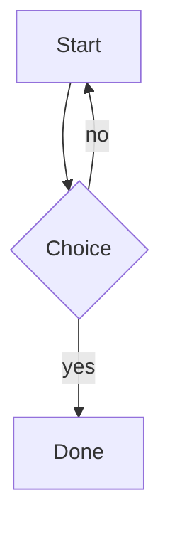

# Fixture P with **bold** and [a link](https://example.com)

This is the one document the export tests and the walk-through use. It holds every construct the output has to get right.

Setext heading
==============

Text before the repeated headings so a heading can land near the end of a page.

## Same name

First section with the repeated heading.

## Same name

Second section with the repeated heading, whose id gets a suffix.

## Reading **this**

A link back to this section: [jump](#reading-this). And one that goes up: [to the top](#Fixture-P-with-bold-and-a-linkhttpsexamplecom).

## Text

*emphasis*, **strong**, ***both***, ~~strike~~, ==highlight==, `inline code`, <u>under</u>, H<sub>2</sub>O, and x<sup>2</sup>.

A bare URL: https://example.com and www.example.com/page and [an explicit link](https://example.com/explicit).

"straight quotes" -- ... 'single' stays as typed.

A hard break ends this line  
and this one follows. A highlight that spans ==markup **inside** it== too.

## Lists

- bullet one
  1. numbered inside
     - bullet inside that
     - another
  2. second numbered
- bullet two

3. starts at three
4. and goes on

- [ ] an open task
- [x] a ticked task
  - [ ] a nested open task
1. [x] a numbered ticked task
2. [ ] a numbered open task

Loose list:

- first

- second

## Quote

> A quote with **formatting**.
>
> > A nested quote with a list:
> >
> > - one
> > - two
> >
> > ```
> > code in a quote
> > ```

## Table

| Row | Code | Value |
|:----|:----:|------:|
| Row 001 | `code 1` | 7<br>second line |
| Row 002 | `code 2` | 14<br>second line |
| Row 003 | `code 3` | 21<br>second line |
| Row 004 | `code 4` | 28<br>second line |
| Row 005 | `code 5` | 35<br>second line |
| Row 006 | `code 6` | 42<br>second line |
| Row 007 | `code 7` | 49<br>second line |
| Row 008 | `code 8` | 56<br>second line |
| Row 009 | `code 9` | 63<br>second line |
| Row 010 | `code 10` | 70<br>second line |
| Row 011 | `code 11` | 77<br>second line |
| Row 012 | `code 12` | 84<br>second line |
| Row 013 | `code 13` | 91<br>second line |
| Row 014 | `code 14` | 98<br>second line |
| Row 015 | `code 15` | 4<br>second line |
| Row 016 | `code 16` | 11<br>second line |
| Row 017 | `code 17` | 18<br>second line |
| Row 018 | `code 18` | 25<br>second line |
| Row 019 | `code 19` | 32<br>second line |
| Row 020 | `code 20` | 39<br>second line |
| Row 021 | `code 21` | 46<br>second line |
| Row 022 | `code 22` | 53<br>second line |
| Row 023 | `code 23` | 60<br>second line |
| Row 024 | `code 24` | 67<br>second line |
| Row 025 | `code 25` | 74<br>second line |
| Row 026 | `code 26` | 81<br>second line |
| Row 027 | `code 27` | 88<br>second line |
| Row 028 | `code 28` | 95<br>second line |
| Row 029 | `code 29` | 1<br>second line |
| Row 030 | `code 30` | 8<br>second line |
| Row 031 | `code 31` | 15<br>second line |
| Row 032 | `code 32` | 22<br>second line |
| Row 033 | `code 33` | 29<br>second line |
| Row 034 | `code 34` | 36<br>second line |
| Row 035 | `code 35` | 43<br>second line |
| Row 036 | `code 36` | 50<br>second line |
| Row 037 | `code 37` | 57<br>second line |
| Row 038 | `code 38` | 64<br>second line |
| Row 039 | `code 39` | 71<br>second line |
| Row 040 | `code 40` | 78<br>second line |
| Row 041 | `code 41` | 85<br>second line |
| Row 042 | `code 42` | 92<br>second line |
| Row 043 | `code 43` | 99<br>second line |
| Row 044 | `code 44` | 5<br>second line |
| Row 045 | `code 45` | 12<br>second line |
| Row 046 | `code 46` | 19<br>second line |
| Row 047 | `code 47` | 26<br>second line |
| Row 048 | `code 48` | 33<br>second line |
| Row 049 | `code 49` | 40<br>second line |
| Row 050 | `code 50` | 47<br>second line |
| Row 051 | `code 51` | 54<br>second line |
| Row 052 | `code 52` | 61<br>second line |
| Row 053 | `code 53` | 68<br>second line |
| Row 054 | `code 54` | 75<br>second line |
| Row 055 | `code 55` | 82<br>second line |
| Row 056 | `code 56` | 89<br>second line |
| Row 057 | `code 57` | 96<br>second line |
| Row 058 | `code 58` | 2<br>second line |
| Row 059 | `code 59` | 9<br>second line |
| Row 060 | `code 60` | 16<br>second line |
| Row 061 | `code 61` | 23<br>second line |
| Row 062 | `code 62` | 30<br>second line |
| Row 063 | `code 63` | 37<br>second line |
| Row 064 | `code 64` | 44<br>second line |
| Row 065 | `code 65` | 51<br>second line |
| Row 066 | `code 66` | 58<br>second line |
| Row 067 | `code 67` | 65<br>second line |
| Row 068 | `code 68` | 72<br>second line |
| Row 069 | `code 69` | 79<br>second line |
| Row 070 | `code 70` | 86<br>second line |
| Row 071 | `code 71` | 93<br>second line |
| Row 072 | `code 72` | 100<br>second line |
| Row 073 | `code 73` | 6<br>second line |
| Row 074 | `code 74` | 13<br>second line |
| Row 075 | `code 75` | 20<br>second line |
| Row 076 | `code 76` | 27<br>second line |
| Row 077 | `code 77` | 34<br>second line |
| Row 078 | `code 78` | 41<br>second line |
| Row 079 | `code 79` | 48<br>second line |
| Row 080 | `code 80` | 55<br>second line |
| Row 081 | `code 81` | 62<br>second line |
| Row 082 | `code 82` | 69<br>second line |
| Row 083 | `code 83` | 76<br>second line |
| Row 084 | `code 84` | 83<br>second line |
| Row 085 | `code 85` | 90<br>second line |
| Row 086 | `code 86` | 97<br>second line |
| Row 087 | `code 87` | 3<br>second line |
| Row 088 | `code 88` | 10<br>second line |
| Row 089 | `code 89` | 17<br>second line |
| Row 090 | `code 90` | 24<br>second line |
| Row 091 | `code 91` | 31<br>second line |
| Row 092 | `code 92` | 38<br>second line |
| Row 093 | `code 93` | 45<br>second line |
| Row 094 | `code 94` | 52<br>second line |
| Row 095 | `code 95` | 59<br>second line |
| Row 096 | `code 96` | 66<br>second line |
| Row 097 | `code 97` | 73<br>second line |
| Row 098 | `code 98` | 80<br>second line |
| Row 099 | `code 99` | 87<br>second line |
| Row 100 | `code 100` | 94<br>second line |
| Row 101 | `code 101` | 0<br>second line |
| Row 102 | `code 102` | 7<br>second line |
| Row 103 | `code 103` | 14<br>second line |
| Row 104 | `code 104` | 21<br>second line |
| Row 105 | `code 105` | 28<br>second line |
| Row 106 | `code 106` | 35<br>second line |
| Row 107 | `code 107` | 42<br>second line |
| Row 108 | `code 108` | 49<br>second line |
| Row 109 | `code 109` | 56<br>second line |
| Row 110 | `code 110` | 63<br>second line |
| Row 111 | `code 111` | 70<br>second line |
| Row 112 | `code 112` | 77<br>second line |
| Row 113 | `code 113` | 84<br>second line |
| Row 114 | `code 114` | 91<br>second line |
| Row 115 | `code 115` | 98<br>second line |
| Row 116 | `code 116` | 4<br>second line |
| Row 117 | `code 117` | 11<br>second line |
| Row 118 | `code 118` | 18<br>second line |
| Row 119 | `code 119` | 25<br>second line |
| Row 120 | `code 120` | 32<br>second line |

## Code

```
</pre><script>alert(1)</script> & <b>
  indented line

after a blank line
```

    an indented code block
      keeps its indentation

```
xxxxxxxxxxxxxxxxxxxxxxxxxxxxxxxxxxxxxxxxxxxxxxxxxxxxxxxxxxxxxxxxxxxxxxxxxxxxxxxxxxxxxxxxxxxxxxxxxxxxxxxxxxxxxxxxxxxxxxxxxxxxxxxxxxxxxxxxxxxxxxxxxxxxxxxxxxxxxxxxxxxxxxxxxxxxxxxxxxxxxxxxxxxxxxxxxxxxxxxxxxxxxxxxxxxxxxxxxxxxxxxxxxxxxxxxxxxxxxxxxxxxxxxxxxxxxxxxxxxxxxxxxxxxxxxxxxxxxxxxxxxxxxxxxxxxxxxxxxxx
```

## Diagrams



The same diagram again:


And one with a syntax error:

```mermaid
graph TD
  A --> ((
```

## Images

A local PNG:  and a local SVG: .

One that is too big (the tests create it): 

One that is missing: 

One over http: 

One over https: 

## HTML

<p align="center"></p>

<details>
<summary>More</summary>

Text **inside** the details.

</details>

<script>alert(1)</script>
<style>p { color: red }</style>
<iframe src="https://example.com"></iframe>

<a href="javascript:alert(1)">bad link</a>
<!-- a comment -->

## Links

[ok](https://example.com), [js](javascript:alert(1)), [mixed]( JaVaScRiPt:alert(1)), [rel](other.md)

## Other

A footnote marker[^1] and another[^2].

[^1]: https://example.com/footnote
[^2]: Plain note.

Inline math $x^2$ and a block:

$$
\int_0^1 x\,dx
$$

---

A long closing paragraph so that headings have somewhere to land on a page boundary. Lorem ipsum dolor sit amet, consectetur adipiscing elit. Lorem ipsum dolor sit amet, consectetur adipiscing elit. Lorem ipsum dolor sit amet, consectetur adipiscing elit. Lorem ipsum dolor sit amet, consectetur adipiscing elit. Lorem ipsum dolor sit amet, consectetur adipiscing elit. Lorem ipsum dolor sit amet, consectetur adipiscing elit. Lorem ipsum dolor sit amet, consectetur adipiscing elit. Lorem ipsum dolor sit amet, consectetur adipiscing elit. Lorem ipsum dolor sit amet, consectetur adipiscing elit. Lorem ipsum dolor sit amet, consectetur adipiscing elit. Lorem ipsum dolor sit amet, consectetur adipiscing elit. Lorem ipsum dolor sit amet, consectetur adipiscing elit. Lorem ipsum dolor sit amet, consectetur adipiscing elit. Lorem ipsum dolor sit amet, consectetur adipiscing elit. Lorem ipsum dolor sit amet, consectetur adipiscing elit. Lorem ipsum dolor sit amet, consectetur adipiscing elit. Lorem ipsum dolor sit amet, consectetur adipiscing elit. Lorem ipsum dolor sit amet, consectetur adipiscing elit. Lorem ipsum dolor sit amet, consectetur adipiscing elit. Lorem ipsum dolor sit amet, consectetur adipiscing elit. Lorem ipsum dolor sit amet, consectetur adipiscing elit. Lorem ipsum dolor sit amet, consectetur adipiscing elit. Lorem ipsum dolor sit amet, consectetur adipiscing elit. Lorem ipsum dolor sit amet, consectetur adipiscing elit. Lorem ipsum dolor sit amet, consectetur adipiscing elit. Lorem ipsum dolor sit amet, consectetur adipiscing elit. Lorem ipsum dolor sit amet, consectetur adipiscing elit. Lorem ipsum dolor sit amet, consectetur adipiscing elit. Lorem ipsum dolor sit amet, consectetur adipiscing elit. Lorem ipsum dolor sit amet, consectetur adipiscing elit. Lorem ipsum dolor sit amet, consectetur adipiscing elit. Lorem ipsum dolor sit amet, consectetur adipiscing elit. Lorem ipsum dolor sit amet, consectetur adipiscing elit. Lorem ipsum dolor sit amet, consectetur adipiscing elit. Lorem ipsum dolor sit amet, consectetur adipiscing elit. Lorem ipsum dolor sit amet, consectetur adipiscing elit. Lorem ipsum dolor sit amet, consectetur adipiscing elit. Lorem ipsum dolor sit amet, consectetur adipiscing elit. Lorem ipsum dolor sit amet, consectetur adipiscing elit. Lorem ipsum dolor sit amet, consectetur adipiscing elit. 
