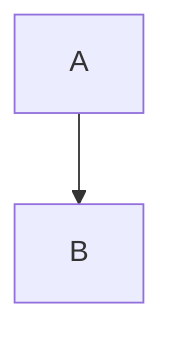

# Project

Intro paragraph.

## Plan

Plan text.

### Tasks

- [ ] Write spec
  - [ ] Draft
  - [x] Review
- [ ] Build

| a | b |
| - | - |
| 1 | 2 |

## Notes

- Groceries
  - Milk
  - Eggs

    Extra paragraph under Eggs.
- Done

## Empty

## Last
Final line, no trailing newline